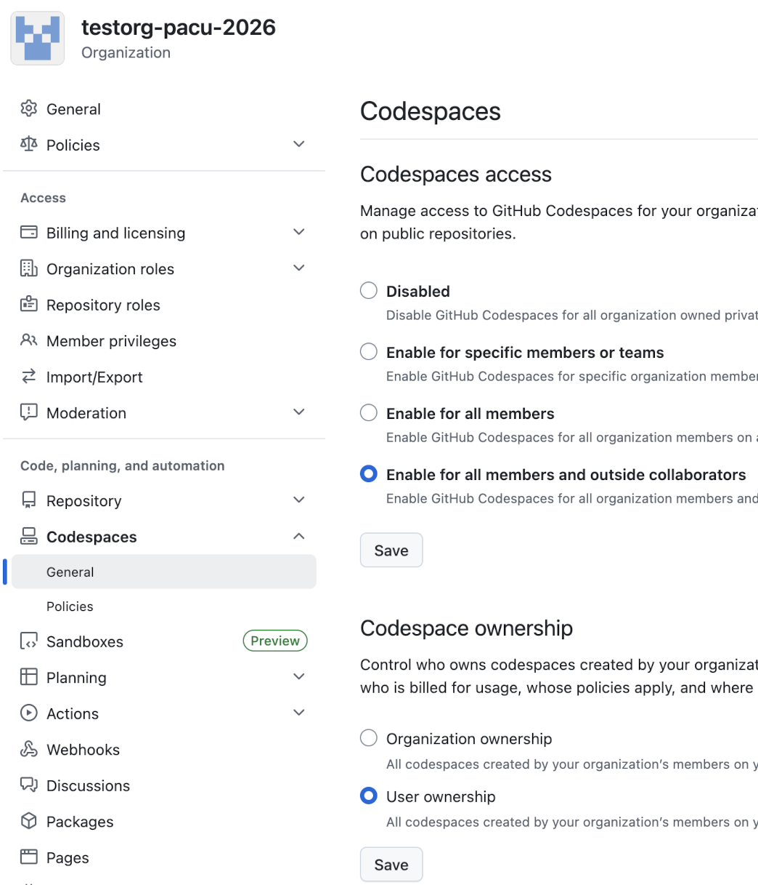

## GitHub Classroom Basic Replacement

* [Install GitHub CLI gh](https://cli.github.com/)
* Use [gh auth](https://cli.github.com/manual/gh_auth_login) to authenticate your account
* __Students__ must signup for a GitHub student account [here](https://github.com/education/students).  This gives students access to Codespaces and CoPilot.

### Organization Creation

* Create the new Organization
* Upgrade the Organization via [GitHub Education](https://education.github.com/globalcampus/teacher)
* Enable Codespaces in the Organization (see image below)
* Set Codespaces ownership to User (see image below)


### Create Student Repositories

* Create a public or private template repository within the Organization
  * The student repositories are always created as private
* Create a CSV file of students:
  ```
  Firstname1 Lastname1,GitHubUsername1
  Firstname2 Lastname2,GitHubUsername2
  ...
  FirstnameN LastnameN,GitHubUsernameN
  ```
* Use the createReposFromStudentFile.sh script
  * Specify the Organization name and template repository name as command line arguments
  * The CSV file is read from STDIN
  ```
  ./createReposFromStudentFile.sh ORG TemplateRepos < CS17001F26Students.csv
  ```
* Repositories of the form __TemplateRepos-GitHubUsername1__ will be created in the organization ORG.
* Students will receive an email invite.

### Dowload Student Repositories
* Use the CSV file of students and run getReposFromStudentFile.sh
  * Specify the Organization name and original template repository name as command line arguments
  * The CSV file is read from STDIN
```
./getReposFromStudentFile.sh ORG TemplateRepos < CS17001F26Students.csv
```
* This will checkout the repositories in the current working directory.

### Create Team Repositories

* Create a public or private template repository within the Organization
  * The team repositories are always created as private
* Create a CSV file of Teams:
  ```
  TeamName1,GitHubUsername1_1,GitHubUsername1_2,...,GitHubUsername1_N
  TeamName2,GitHubUsername2_1,GitHubUsername2_2,...,GitHubUsername2_N
  ...
  TeamNameN,GitHubUsernameN_1,GitHubUsernameN_2,...,GitHubUsernameN_N
  ```
* Use the createTeamReposFromTeamFile.sh script
  * Specify the Organization name and template repository name as command line arguments
  * The CSV file is read from STDIN

  ```
  ./createTeamReposFromTeamFile.sh ORG TemplateRepos < CS17001F26DiceGameTeams.csv
  ```
* Repositories of the form __TemplateRepos-TeamName1__ will be created in the organization ORG.
* Students will receive an email invite.

### Dowload Team Repositories
* Use the CSV file of teams and run getTeamReposFromTeamFile.sh
  * Specify the Organization name and original template repository name as command line arguments
  * The CSV file is read from STDIN

```
./getTeamReposFromTeamFile.sh ORG TemplateRepos < CS17001F26DiceGameTeams.csv
```
* This will checkout the repositories in the current working directory.